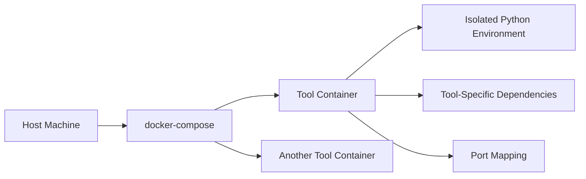

# MCP Operator Architecture

## Containerization Strategy

## File Descriptions
| File | Purpose | Owner |
|------|---------|-------|
| `docker-compose.yml` | Orchestrate multiple MCP services | DevOps Agent |
| `Dockerfile.*` | Tool-specific container builds | Code Agent |
| `src/mcp_tools/` | Core Python package structure | Code Agent |