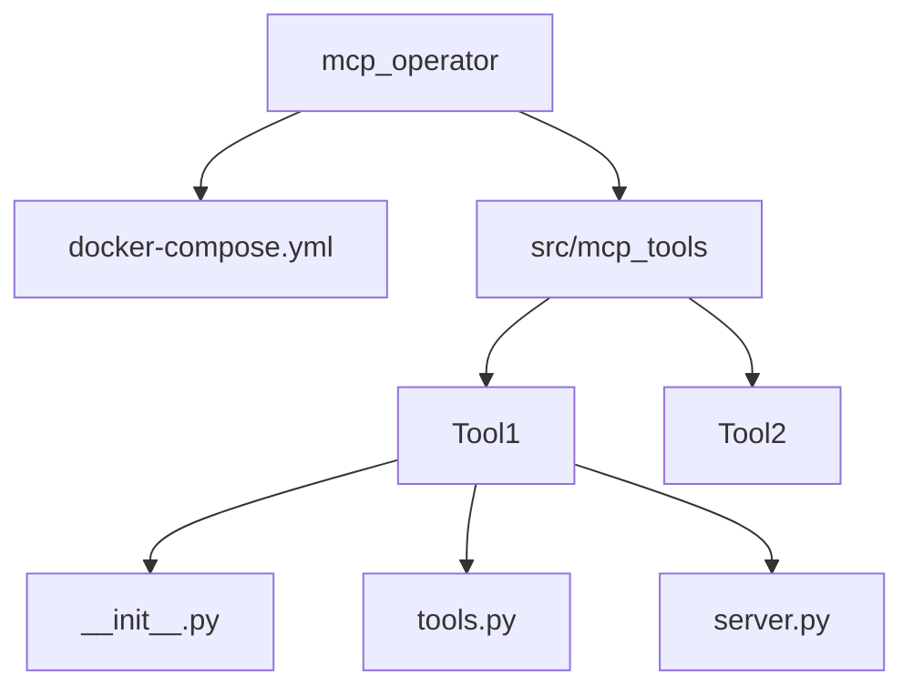

# MCP Operator Project Plan

## MVP Definition
- Core Features:
  - Multiple isolated MCP tool services
  - Docker-based deployment
  - Poetry dependency management
  - Modular architecture

## System Architecture

## Project Structure
[PROJECT_STRUCTURE.md](PROJECT_STRUCTURE.md)

## Initial Setup
1. `poetry init`
2. `docker-compose build`
3. `cp .env.example .env`