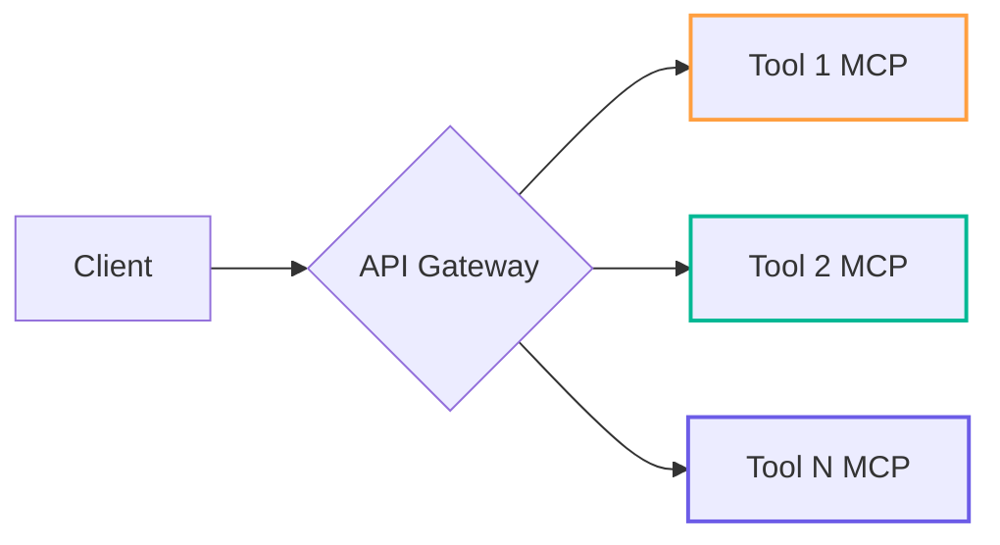

# Modular Context Protocol Operator


## Development Workflow
```bash
# Create new tool scaffold
uvx mcp-scaffold create-tool NEW_TOOL_NAME

# Build specific tool
docker compose build TOOL_NAME

# Run with dependency isolation
docker compose up -d TOOL_NAME

# Monitor tool operations
uvx mcp-monitor TOOL_NAME --follow
```

## Environment Management
1. Copy environment template:
```bash
cp .env.example .env
```
2. Configure services in `docker-compose.yml`:
```yaml
services:
  tool-name-mcp:
    build:
      context: .
      dockerfile: Dockerfile.TOOL_NAME
    ports:
      - "PORT:PORT"
    env_file: .env
    volumes:
      - ./src/mcp_tools/TOOL_NAME:/app
```

## Service Orchestration


## Implementation Process
1. Reference [ARCHITECTURE.md](ARCHITECTURE.md) for design patterns
2. Follow [TASKS.md](TASKS.md) phase gates
3. Validate against [PROJECT_STRUCTURE.md](PROJECT_STRUCTURE.md)
4. Update [ORCHESTRATOR_LOG.yaml](logs/orchestrator_log.yaml)

## Operational Documentation
```bash
# Generate full API documentation
uvx mcp-docs generate --format openapi

# Run validation suite
uvx mcp-test run --coverage