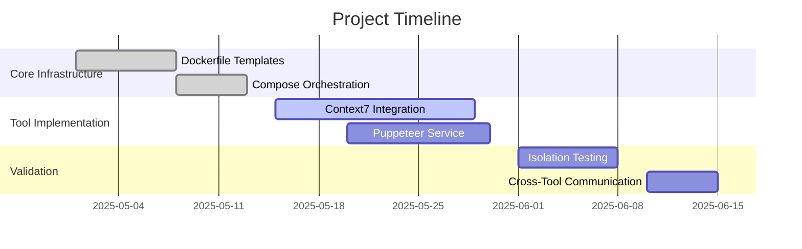

# MCP Operator Phase Gates

## Implementation Milestones


## Role Responsibilities
| Component         | Owner       | Verification Criteria                 |
|-------------------|-------------|----------------------------------------|
| Dockerfiles       | DevOps      | Builds without dependency conflicts    |
| MCP Servers       | Tool Teams  | Passes integration tests               |
| Documentation     | Tech Writers| 100% API coverage                      |

## Dependency Matrix
```vega-lite
{
  "$schema": "https://vega.github.io/schema/vega-lite/v5.json",
  "data": {
    "values": [
      {"tool": "context7", "dependencies": 12, "conflicts": 0},
      {"tool": "puppeteer", "dependencies": 8, "conflicts": 2}
    ]
  },
  "mark": "bar",
  "encoding": {
    "x": {"field": "tool", "type": "nominal"},
    "y": {"field": "dependencies", "type": "quantitative"},
    "color": {"field": "conflicts", "type": "quantitative"}
  }
}
```

## Quality Gates
1. Maximum 2 dependency conflicts per tool
2. 95% test coverage for core utilities
3. All services pass isolation validation