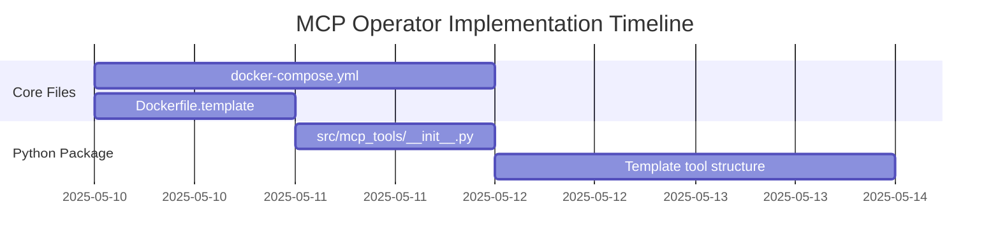

# Implementation Tasks

## Core Infrastructure

## Agent Assignments
| File | Agent | Acceptance Criteria |
|------|-------|---------------------|
| `docker-compose.yml` | DevOps Agent | Multi-service setup with port mappings |
| `Dockerfile.*` | Code Agent | Tool-specific builds with dependency isolation |
| Python package structure | Code Agent | PEP-8 compliant with proper namespace |