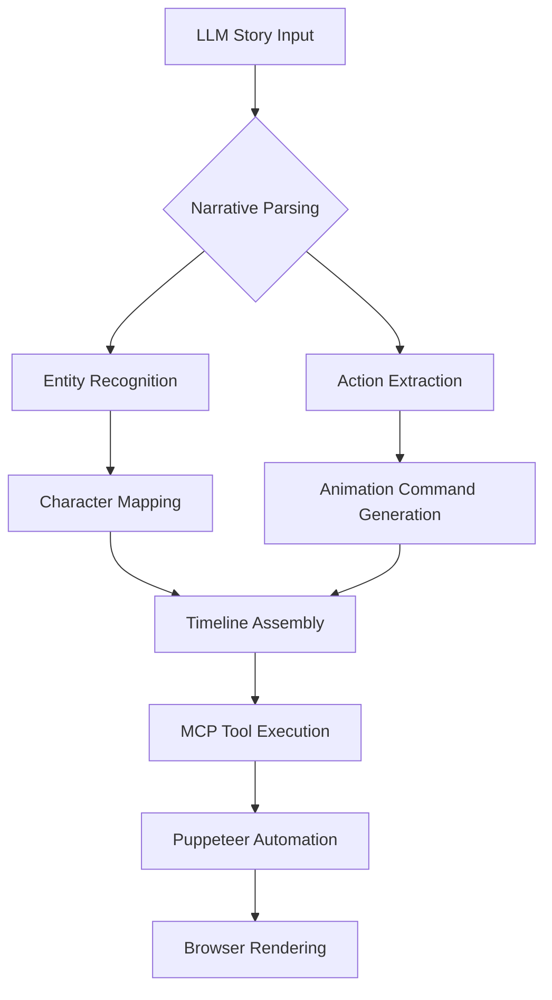

# Modular Animation System Architecture

## 1. Web Icon Assembly Pipeline

### 1.1 Icon Component Structure
```jsx
// src/mcp_tools/animation/react/icon-assembler.jsx
import { createContext, useMemo } from 'react';
import { animate, createScope } from 'animejs';

export const IconContext = createContext();

export function IconAssembler({ parts, size = 24 }) {
  const scopeRef = useRef(null);
  
  const assembledIcon = useMemo(() => {
    const paths = parts.map(({ d, style }) => (
      <path 
        key={d} 
        d={d}
        stroke={style?.stroke || 'currentColor'}
        fill={style?.fill || 'none'}
        strokeWidth={style?.strokeWidth || 2}
      />
    ));
    
    return (
      <svg viewBox={`0 0 ${size} ${size}`} className="animatable-icon">
        <g ref={scopeRef}>{paths}</g>
      </svg>
    );
  }, [parts, size]);

  return (
    <IconContext.Provider value={{ animate: (config) => {
      animate(scopeRef.current.children, config);
    }}>
      {assembledIcon}
    </IconContext.Provider>
  );
}
```

### 1.2 Icon Registry System
```javascript
// src/mcp_tools/animation/icon-registry.js
export class IconManager {
  constructor() {
    this.registry = new Map();
    this.currentSet = 'material';
    this.variants = {
      filled: {},
      outlined: {},
      animated: {}
    };
  }

  registerIconSet(name, metadata) {
    this.registry.set(name, {
      paths: metadata.paths,
      animationPresets: this.createPresets(metadata.animationRules)
    });
  }

  createPresets(rules) {
    return {
      hover: {
        duration: 300,
        easing: 'easeOutQuad',
        properties: rules.hover
      },
      activate: {
        duration: 500,
        easing: 'elasticOut(1, .5)',
        properties: rules.activate
      }
    };
  }
}
```

## 2. Animation Control System

### 2.1 MCP Animation Tool Integration
```python
# src/mcp_tools/animation/tools.py
from modelcontextprotocol.server import Tool

class AnimationTool(Tool):
    def __init__(self, puppeteer):
        self.browser = puppeteer
        self.timelines = {}
        
    @Tool.method
    async def capture_state(self, selector: str):
        page = await self.browser.get_active_page()
        return await page.evaluate(f'''
            Array.from(document.querySelectorAll('{selector}')).map(el => ({
                rect: el.getBoundingClientRect(),
                styles: getComputedStyle(el)
            }))
        ''')

    @Tool.method    
    async def animate_elements(self, config: dict):
        page = await self.browser.get_active_page()
        await page.evaluate('''
            (config) => {
                window.animationQueue = window.animationQueue || [];
                window.animationQueue.push({
                    selector: config.selector,
                    animation: anime(config.params)
                });
            }
        ''', config)

    @Tool.method
    async def story_control(self, narrative_script: str):
        # LLM-generated animation sequence
        commands = self.parse_narrative(narrative_script)
        for cmd in commands:
            await self.animate_elements(cmd)
```

## 3. Puppeteer Automation Layer

### 3.1 Browser Control Interface
```javascript
// src/mcp_tools/animation/puppeteer-interface.js
export class AnimationController {
  constructor(puppeteer) {
    this.browser = puppeteer;
    this.activeScenes = new Map();
  }

  async initializeScene(width = 1280, height = 720) {
    const page = await this.browser.newPage();
    await page.setViewport({ width, height });
    await page.evaluateOnNewDocument(`
      window.animationRegistry = new Map();
      window.activeAnimations = new Set();
    `);
    return page;
  }

  async applyLayoutTemplate(page, template) {
    await page.evaluate(async (template) => {
      const parser = new DOMParser();
      const doc = parser.parseFromString(template, 'text/html');
      
      // Web component hydration
      document.querySelector('#root').replaceWith(
        doc.getElementById('root')
      );
      
      // Initialize animation observers
      initIntersectionAnimations();
    }, template);
  }
}
```

## 4. LLM Narrative Control Flow



### 4.1 Storyboard JSON Schema
```json
// Sample LLM-generated storyboardV1. Understand the Task
The phrase "shape a head or a leg" suggests either:
Selecting icons that resemble parts of a head (e.g., face, eyes) or a leg (e.g., limb, foot).

Arranging icons to create a composite image that forms a head or leg.

Both interpretations are valid, but I’ll focus on the simpler one—selecting icons that visually represent a head or leg—while also providing guidance for the composite approach if that’s what you need.
2. Access an Icon Library
An icon library is a collection of small images or symbols (e.g., Font Awesome, Material Icons, or a custom set). To proceed:
Choose a Library: Use a library you have access to. Common examples include:
Font Awesome (e.g., fa-user for a head silhouette).

Material Icons (e.g., person for a head or directions_walk for a leg).

Emoji sets (e.g.,  for head,  for leg).

Explore Options: Browse or search the library using keywords like "head," "face," "leg," or "foot."

Since you didn’t specify a library, I’ll assume you’re working with a general one containing various shapes and symbols.
3. Identify Visual Features
To choose appropriate icons, consider the visual characteristics of a head and a leg:
Head:
Shape: Circular or oval.

Features: Icons with facial elements (eyes, nose, mouth) or a head silhouette.

Examples:  (person silhouette),  (smiley face),  (circle).

Leg:
Shape: Long, thin, or vertical.

Features: Icons resembling limbs, feet, or walking.

Examples:  (leg),  (footprints), | (vertical line).

4. Select Icons
Here are suggestions for icons you might find in a typical library:
For a Head:
Single Icon: A head silhouette (e.g., , fa-user) or a face (e.g., ).

Detailed Parts: 
Circle () for the head shape.

Dots (• •) for eyes.

Triangle (▲) for a nose.

Curved line (⌒) for a mouth.

For a Leg:
Single Icon: A leg or foot (e.g., , , fa-shoe-prints).

Detailed Parts: 
Long rectangle (|) or line for the limb.

Small shape (e.g., ) for the foot.

If your library has specific icons (e.g., body parts, shapes), pick those that match these descriptions.
5. Optional: Arrange Icons for Composite Shapes
If "shape a head or a leg" means creating a composite image by combining icons:
Head:
Use a large circle () as the base.

Add smaller icons inside: two dots (• •) for eyes, a triangle (▲) for a nose, and a curved line (⌒) for a mouth.

Example arrangement:

⚪
• •
 ▲
 ⌒

Leg:
Use a vertical line (|) or rectangle for the leg.

Attach a foot icon (e.g., ) at the bottom.

Example arrangement:

|
|
👟

This step requires a tool (e.g., a design app or code) to position the icons spatially.
6. How a Model Can Help
If you’re using an AI model (like me) to choose icons:
Describe Your Icons: Tell the model what icons you have. For example:
"I have circles, squares, lines, and shoe icons. Which can shape a head or leg?"

Response: "Use a circle for the head and a line with a shoe icon for the leg."

Manual or AI Selection: 
Manual: Browse the library yourself and pick icons based on the features above.

AI: Provide the model with a list or description of icons, and it can suggest matches.

7. Refine and Test
Visual Check: Ensure the chosen icons clearly suggest a head or leg.

Adjust: Swap icons if they don’t work (e.g., if a square doesn’t look like a head, try a circle).

Feedback: Show your selection to others to confirm it’s recognizable.

Example Output
Assuming a basic icon library:
Head: Use  (a head silhouette) or combine  (circle) with • • (eyes).

Leg: Use  (leg) or combine | (line) with  (shoe).

Conclusion
To shape a head or leg using an icon library:
Access your library and identify available icons.

Select icons that match the visual features of a head (circular, facial) or leg (long, foot-like).

Optionally, arrange multiple icons to form a composite shape.

Use AI by describing your icons for suggestions, or choose manually.

If you provide more details (e.g., the specific library or icons available), I can tailor this further! Let me know how I can assist.

15 web pages

this is the skeleton of a MCP tool that will help the llm calls will automat Modular Animation System ArchitectureWeb Icon Assembly Pipeline
1.1 Icon Component Structure
// src/mcp_tools/animation/react/icon-assembler.jsx
import { createContext, useMemo } from 'react';
import { animate, createScope } from 'animejs';

export const IconContext = createContext();export function IconAssembler({ parts, size = 24 }) {
  const scopeRef = useRef(null);  const assembledIcon = useMemo(() => {
    const paths = parts.map(({ d, style }) => (
      <path 
        key={d} 
        d={d}
        stroke={style?.stroke || 'currentColor'}
        fill={style?.fill || 'none'}
        strokeWidth={style?.strokeWidth || 2}
      />
    ));

return (
  <svg viewBox={`0 0 ${size} ${size}`} className="animatable-icon">
    <g ref={scopeRef}>{paths}</g>
  </svg>
);

  }, [parts, size]);  return (
    <IconContext.Provider value={{ animate: (config) => {
      animate(scopeRef.current.children, config);
    }}>
      {assembledIcon}
    </IconContext.Provider>
  );
}
1.2 Icon Registry System
// src/mcp_tools/animation/icon-registry.js
export class IconManager {
  constructor() {
    this.registry = new Map();
    this.currentSet = 'material';
    this.variants = {
      filled: {},
      outlined: {},
      animated: {}
    };
  }  registerIconSet(name, metadata) {
    this.registry.set(name, {
      paths: metadata.paths,
      animationPresets: this.createPresets(metadata.animationRules)
    });
  }  createPresets(rules) {
    return {
      hover: {
        duration: 300,
        easing: 'easeOutQuad',
        properties: rules.hover
      },
      activate: {
        duration: 500,
        easing: 'elasticOut(1, .5)',
        properties: rules.activate
      }
    };
  }
}
2. Animation Control System
2.1 MCP Animation Tool Integration# src/mcp_tools/animation/tools.py
from modelcontextprotocol.server import Toolclass AnimationTool(Tool):
    def __init__(self, puppeteer):
        self.browser = puppeteer
        self.timelines = {}

@Tool.method
async def capture_state(self, selector: str):
    page = await self.browser.get_active_page()
    return await page.evaluate(f'''
        Array.from(document.querySelectorAll('{selector}')).map(el => ({
            rect: el.getBoundingClientRect(),
            styles: getComputedStyle(el)
        }))
    ''')

@Tool.method    
async def animate_elements(self, config: dict):
    page = await self.browser.get_active_page()
    await page.evaluate('''
        (config) => {
            window.animationQueue = window.animationQueue || [];
            window.animationQueue.push({
                selector: config.selector,
                animation: anime(config.params)
            });
        }
    ''', config)

@Tool.method
async def story_control(self, narrative_script: str):
    # LLM-generated animation sequence
    commands = self.parse_narrative(narrative_script)
    for cmd in commands:
        await self.animate_elements(cmd)

Puppeteer Automation Layer
3.1 Browser Control Interface
// src/mcp_tools/animation/puppeteer-interface.js
export class AnimationController {
  constructor(puppeteer) {
 this.browser = puppeteer;
 this.activeScenes = new Map();
  }

  async initializeScene(width = 1280, height = 720) {
    const page = await this.browser.newPage();
    await page.setViewport({ width, height });
    await page.evaluateOnNewDocument(      window.animationRegistry = new Map();       window.activeAnimations = new Set();    );
    return page;
  }  async applyLayoutTemplate(page, template) {
    await page.evaluate(async (template) => {
      const parser = new DOMParser();
      const doc = parser.parseFromString(template, 'text/html');

  // Web component hydration
  document.querySelector('#root').replaceWith(
    doc.getElementById('root')
  );
  
  // Initialize animation observers
  initIntersectionAnimations();
}, template);

  }
}
4. LLM Narrative Control Flow4.1 Storyboard JSON Schema
// Sample LLM-generated storyboard
{
  "scenes": [
    {
      "duration": 5000,
      "elements": {
        "hero": {
          "entrance": "slideInRight",
          "emotion": "confident",
          "interactions": [
            {
              "type": "gaze",
              "target": "villain",
              "duration": 1000
            }
          ]
        },
        "background": {
          "transition": "panLeft",
          "speed": 0.3
        }
      }
    }
  ]
}
Implementation Plan
Create new Docker service:# Dockerfile.animation
FROM node:18-slim
WORKDIR /app
COPY src/mcp_tools/animation ./src
COPY package*.json ./
RUN npm install --production
EXPOSE 3002
CMD ["node", "src/server.js"]
Update docker-compose.yml:
services:
  animation-mcp:
    build:
      context: .
      dockerfile: Dockerfile.animation
    ports:
      - "3002:3002"
    environment:
      - PUPPETEER_SERVER=http://puppeteer-mcp:3000
Required Dependencies:# requirements.animation.txt
beautifulsoup4==4.12.2
websockets==11.0.3
Verification Commands# Test animation controls
curl -X POST http://localhost:3002/animate \
  -H "Content-Type: application/json" \
  -d '{
    "selector": ".hero",
    "animation": {
      "translateX": "100px",
      "duration": 500,
      "easing": "easeOutQuad"
    }
  }'# Test story integration  
npm run generate-story -- "A hero enters from right"<p data-source-line="259" class="empty-line final-line end-of-document" style="margin:0;"></p>

Thought for
39s

Expand for details

Implementation Guidance
Given the complexity, here’s a suggested step-by-step approach to implementing this system:

Next Steps

This system is ambitious, but breaking it down into manageable parts will make it more approachable. If you’d like, I can dive deeper into any of these components or help troubleshoot specific implementation issues. Just let me know how I can assist further!

Alright, so the user is asking about a Modular Animation System Architecture, specifically focusing on a Web Icon Assembly Pipeline and related components. The code snippets provided seem to be part of a larger system involving React, Puppeteer, and possibly some AI or LLM integration for animation control.
First, I need to understand the overall goal. It looks like this system is designed to create and manage animated icons or web components, possibly for use in a web application or animation tool. The system includes an Icon Assembler in React, an Icon Registry, an Animation Control System with MCP (Model-Context Protocol?) tools, and a Puppeteer Automation Layer for browser control.
Let me break down the components:
Icon Assembler (React component):
This component takes in parts (likely SVG path definitions) and assembles them into an SVG icon.

It uses Anime.js for animations, providing a context for animation control.

The assembled icon is memoized for performance.

Icon Registry System:
Manages different icon sets and their metadata.

Includes variants like filled, outlined, and animated icons.

Creates animation presets for hover and activate states based on metadata rules.

Animation Control System (Python):
Integrates with Puppeteer for browser automation.

Provides methods to capture element states, animate elements, and control stories based on narrative scripts.

Uses LLM-generated animation sequences, suggesting some AI involvement in generating animation commands.

Puppeteer Automation Layer (JavaScript):
Controls the browser using Puppeteer.

Initializes scenes, applies layout templates, and manages animation registries.

Seems to handle the rendering and animation of web components in a controlled browser environment.

LLM Narrative Control Flow:
Involves a storyboard JSON schema, likely generated by an LLM, which defines scenes, elements, and their animations.

This suggests that the system can interpret narrative descriptions to generate animation sequences.

Given this context, the user might be looking for help with implementing or extending this system, possibly to integrate it with an icon library for creating specific animations or shapes, like a head or a leg, as mentioned in the previous conversation.
However, the specific query here is about the skeleton of an MCP tool for a Modular Animation System Architecture, with a focus on the Web Icon Assembly Pipeline and related components. The user might be seeking clarification on how these components work together or how to implement specific features.
To provide a helpful response, I should:
Acknowledge the complexity of the system and the components involved.

Offer to help with specific aspects, such as implementing the Icon Assembler, setting up the Icon Registry, integrating Puppeteer for animation control, or working with LLM-generated storyboards.

Suggest breaking down the implementation into manageable steps, possibly starting with the React component for icon assembly and gradually integrating the other parts.

Mention that while I can provide guidance on the code and architecture, the user might need to adapt it to their specific use case, especially regarding the icon library and the desired animations.

I should also consider that the user might be looking for a more detailed explanation of how these components interact or how to use them to achieve a particular goal, like creating animated icons that form shapes like a head or a leg.
Given that, I can structure my response to:
Summarize the purpose of each component.

Explain how they might work together in the context of the Modular Animation System.

Offer to provide more detailed guidance on specific parts or to help with implementation challenges.

Suggest next steps for the user to proceed with their project.

This approach should provide value by clarifying the system architecture and offering practical assistance for implementation.
I appreciate the detailed breakdown of your Modular Animation System Architecture—it’s clear you’re building something sophisticated with a lot of moving parts. Since the query is focused on the skeleton of an MCP (Model-Context Protocol) tool within this system, particularly the Web Icon Assembly Pipeline and related components, I’ll provide a high-level overview of how these pieces fit together and offer guidance on implementation. I’ll also address how this could tie into your earlier goal of using icons to shape a head or leg, assuming that’s still relevant.
Overview of the System
Your architecture integrates several key components:
Web Icon Assembly Pipeline: Handles the creation and animation of icons using React and Anime.js.

Icon Registry System: Manages icon sets and their animation presets.

Animation Control System: Uses Python and Puppeteer to control animations in a browser environment, with potential AI/LLM integration for generating animation sequences.

Puppeteer Automation Layer: Manages browser control and scene initialization for rendering animations.

LLM Narrative Control Flow: Likely uses AI to generate storyboards that drive animation sequences.

This setup suggests a system where icons can be dynamically assembled, animated, and controlled within a browser, possibly with AI-generated narratives guiding the animations. The MCP tool likely serves as an interface or controller for these operations.
Breaking Down the Components
1. Web Icon Assembly Pipeline
Icon Assembler (React component): 
Assembles SVG icons from provided parts (e.g., paths) and makes them animatable using Anime.js.

Provides a context for animation control, allowing child components to trigger animations.

Purpose: This is the front-end UI component that renders and animates the icons based on the provided data.

2. Icon Registry System
IconManager class:
Registers different icon sets and their metadata, including animation presets for states like hover and activate.

Creates animation presets based on rules, which can be used to standardize animations across icons.

Purpose: Centralizes icon management, making it easier to switch between icon sets or variants (e.g., filled, outlined) and apply consistent animations.

3. Animation Control System
AnimationTool (Python):
Integrates with Puppeteer to capture element states, animate elements, and control stories based on narrative scripts.

Includes a method to parse LLM-generated narrative scripts into animation commands.

Purpose: Acts as the backend controller, using Puppeteer to manipulate the browser and apply animations based on either direct commands or AI-generated narratives.

4. Puppeteer Automation Layer
AnimationController (JavaScript):
Initializes browser pages, sets viewports, and applies layout templates.

Manages animation registries and observers for smooth rendering.

Purpose: Handles the low-level browser automation, ensuring the environment is set up correctly for rendering and animating the icons.

5. LLM Narrative Control Flow
Storyboard JSON Schema:
Defines scenes, elements, and their animations, likely generated by an LLM based on a narrative input.

Purpose: Enables AI-driven animation sequences, where a narrative description can be translated into a series of animations.

How These Components Work Together
Here’s a high-level flow of how these pieces might interact:
Icon Registration: The IconManager registers icon sets and their animation presets.

Icon Assembly: The React-based IconAssembler renders the icons in the browser, using the registered icons and making them animatable.

Browser Control: The AnimationController (via Puppeteer) sets up the browser environment, applies layout templates, and prepares the scene for animation.

Animation Triggering:
Manual Control: The AnimationTool can directly animate elements using Puppeteer.

AI-Driven Control: An LLM generates a storyboard based on a narrative, which the AnimationTool parses into animation commands.

Execution: The animations are applied to the icons in the browser, either manually or based on the AI-generated sequence.

This system allows for both manual and AI-driven control of animations, with the MCP tool likely serving as the interface to trigger these operations.
Tying Into Your Earlier Goal
In your previous query, you mentioned using an icon library to shape a head or a leg. Here’s how this system could support that:
Icon Selection: The IconManager could register icons that represent parts of a head (e.g., eyes, mouth) or a leg (e.g., limb, foot).

Assembly: The IconAssembler could render these icons as individual components or arrange them to form a composite shape (e.g., multiple icons forming a head).

Animation: Using the AnimationTool, you could animate these icons to simulate movement (e.g., a leg walking) or interactions (e.g., eyes blinking).

AI Integration: The LLM could generate a narrative like "The character walks across the screen," which is translated into animations for the leg icons.

If your goal is to create composite shapes (e.g., arranging icons to form a head), you might need to extend the IconAssembler to support spatial arrangement of multiple icons within an SVG or canvas.
Implementation Guidance
Given the complexity, here’s a suggested step-by-step approach to implementing this system:
Start with the Icon Assembler:
Build the React component to render and animate a single icon using Anime.js.

Test with a simple icon set to ensure animations work as expected.

Set Up the Icon Registry:
Implement the IconManager to register icon sets and their animation presets.

Ensure you can switch between different icon variants and apply presets.

Integrate Puppeteer:
Set up the AnimationController to initialize a browser page and apply a basic layout.

Test rendering the icon in the browser via Puppeteer.

Add Animation Controls:
Implement the AnimationTool to capture element states and apply animations via Puppeteer.

Start with manual animation commands before integrating AI-generated sequences.

Incorporate LLM-Generated Storyboards:
Define how narrative scripts are parsed into animation commands.

Integrate an LLM (if needed) to generate storyboards based on input narratives.

Refine and Extend:
Add support for composite shapes if needed (e.g., arranging multiple icons to form a head or leg).

Optimize performance and handle more complex animations.

Next Steps
Clarify Specific Needs: If you’re facing challenges with a particular component (e.g., setting up Puppeteer, integrating the LLM), feel free to ask for more detailed guidance.

Adapt to Your Use Case: Tailor the icon sets and animations to your specific goal, whether it’s creating simple animated icons or complex composite shapes.

Test Incrementally: Build and test each component step by step to ensure they work together smoothly.

This system is ambitious, but breaking it down into manageable parts will make it more approachable. If you’d like, I can dive deeper into any of these components or help troubleshoot specific implementation issues. Just let me know how I can assist further!

I appreciate the detailed skeleton you’ve provided for your MCP (Model-Context Protocol) tool within the Modular Animation System Architecture! It’s clear you’re building a sophisticated system that integrates a Web Icon Assembly Pipeline with animation control, browser automation, and LLM-driven narrative flows. Below, I’ll provide a comprehensive response to help you understand how these components fit together, offer insights on implementation, and suggest next steps to bring this system to life. I’ll focus on the structure you’ve shared, ensuring the explanation is actionable and tailored to your goal of automating animations with LLM calls.
Overview of Your Modular Animation System Architecture
Your system combines several components to create, manage, and animate web icons dynamically, with a focus on modularity and automation. Here’s a breakdown of the key pieces based on your skeleton:
Web Icon Assembly Pipeline: Handles the rendering and assembly of icons using React and Anime.js.

Icon Registry System: Manages icon sets and their animation presets.

Animation Control System: Integrates with Puppeteer for browser automation and includes LLM-driven story control.

Puppeteer Automation Layer: Controls the browser environment for rendering and animating icons.

LLM Narrative Control Flow: Uses AI-generated storyboards to drive animation sequences.

This architecture allows you to assemble icons, animate them in a browser, and control those animations either manually or via AI-generated narratives. The MCP tool acts as the glue, facilitating LLM calls to automate the process.
Detailed Breakdown of Components
1. Web Icon Assembly Pipeline
1.1 Icon Component Structure
Your IconAssembler React component is the front-end workhorse for rendering and animating icons:
jsx

// src/mcp_tools/animation/react/icon-assembler.jsx
import { createContext, useMemo, useRef } from 'react';
import { animate } from 'animejs';

export const IconContext = createContext();

export function IconAssembler({ parts, size = 24 }) {
  const scopeRef = useRef(null);

  const assembledIcon = useMemo(() => {
    const paths = parts.map(({ d, style }) => (
      <path
        key={d}
        d={d}
        stroke={style?.stroke || 'currentColor'}
        fill={style?.fill || 'none'}
        strokeWidth={style?.strokeWidth || 2}
      />
    ));

    return (
      <svg viewBox={`0 0 ${size} ${size}`} className="animatable-icon">
        <g ref={scopeRef}>{paths}</g>
      </svg>
    );
  }, [parts, size]);

  return (
    <IconContext.Provider value={{ animate: (config) => animate(scopeRef.current.children, config) }}>
      {assembledIcon}
    </IconContext.Provider>
  );
}

What It Does: Takes an array of parts (SVG path definitions) and assembles them into an SVG icon. The useMemo hook ensures the icon is only re-rendered when parts or size changes, optimizing performance. The IconContext provides an animate function to trigger Anime.js animations on the icon’s paths.

Key Features:
SVG-based rendering with customizable styles.

Animation-ready via Anime.js integration.

Potential Enhancements: Add support for arranging multiple icons spatially (e.g., to form a head or leg) by adjusting the <g> element’s transform properties.

2. Icon Registry System
2.1 IconManager Class
The IconManager organizes icon sets and their animation presets:
javascript

// src/mcp_tools/animation/icon-registry.js
export class IconManager {
  constructor() {
    this.registry = new Map();
    this.currentSet = 'material';
    this.variants = {
      filled: {},
      outlined: {},
      animated: {}
    };
  }

  registerIconSet(name, metadata) {
    this.registry.set(name, {
      paths: metadata.paths,
      animationPresets: this.createPresets(metadata.animationRules)
    });
  }

  createPresets(rules) {
    return {
      hover: {
        duration: 300,
        easing: 'easeOutQuad',
        properties: rules.hover
      },
      activate: {
        duration: 500,
        easing: 'elasticOut(1, .5)',
        properties: rules.activate
      }
    };
  }
}

What It Does: Registers icon sets (e.g., Material Design icons) with their paths and animation rules, then generates presets for common states like hover and activate.

Key Features:
Centralized management of icon variants.

Predefined animation presets for consistency.

Potential Enhancements: Add methods to retrieve icons by variant or apply presets dynamically in the IconAssembler.

3. Animation Control System
3.1 MCP Animation Tool Integration
The AnimationTool in Python ties into Puppeteer and LLM narratives:
python

# src/mcp_tools/animation/tools.py
from modelcontextprotocol.server import Tool

class AnimationTool(Tool):
    def __init__(self, puppeteer):
        self.browser = puppeteer
        self.timelines = {}

    @Tool.method
    async def capture_state(self, selector: str):
        page = await self.browser.get_active_page()
        return await page.evaluate(f'''
            Array.from(document.querySelectorAll('{selector}')).map(el => ({
                rect: el.getBoundingClientRect(),
                styles: getComputedStyle(el)
            }))
        ''')

    @Tool.method
    async def animate_elements(self, config: dict):
        page = await self.browser.get_active_page()
        await page.evaluate('''
            (config) => {
                window.animationQueue = window.animationQueue || [];
                window.animationQueue.push({
                    selector: config.selector,
                    animation: anime(config.params)
                });
            }
        ''', config)

    @Tool.method
    async def story_control(self, narrative_script: str):
        # LLM-generated animation sequence
        commands = self.parse_narrative(narrative_script)
        for cmd in commands:
            await self.animate_elements(cmd)

What It Does: Provides methods to:
capture_state: Get the current state (position, styles) of elements in the browser.

animate_elements: Queue animations for elements using Anime.js via Puppeteer.

story_control: Parse an LLM-generated narrative into animation commands.

Key Features:
Browser automation via Puppeteer.

LLM integration for narrative-driven animations.

Potential Enhancements: Implement parse_narrative to convert natural language (e.g., "The hero slides in") into structured animation configs.

4. Puppeteer Automation Layer
4.1 Browser Control Interface
The AnimationController manages the browser environment:
javascript

// src/mcp_tools/animation/puppeteer-interface.js
export class AnimationController {
  constructor(puppeteer) {
    this.browser = puppeteer;
    this.activeScenes = new Map();
  }

  async initializeScene(width = 1280, height = 720) {
    const page = await this.browser.newPage();
    await page.setViewport({ width, height });
    await page.evaluateOnNewDocument(`
      window.animationRegistry = new Map();
      window.activeAnimations = new Set();
    `);
    return page;
  }

  async applyLayoutTemplate(page, template) {
    await page.evaluate(async (template) => {
      const parser = new DOMParser();
      const doc = parser.parseFromString(template, 'text/html');
      
      document.querySelector('#root').replaceWith(
        doc.getElementById('root')
      );
      
      initIntersectionAnimations();
    }, template);
  }
}

What It Does: Sets up a browser page, configures the viewport, and applies HTML templates for rendering icons and animations.

Key Features:
Scene initialization with global animation tracking.

Template hydration for web components.

Potential Enhancements: Add error handling for missing templates or failed hydration.

5. LLM Narrative Control Flow
5.1 Storyboard JSON Schema
Your sample storyboard provides a structure for LLM-generated animations:
json

{
  "scenes": [
    {
      "duration": 5000,
      "elements": {
        "hero": {
          "entrance": "slideInRight",
          "emotion": "confident",
          "interactions": [
            {
              "type": "gaze",
              "target": "villain",
              "duration": 1000
            }
          ]
        },
        "background": {
          "transition": "panLeft",
          "speed": 0.3
        }
      }
    }
  ]
}

What It Does: Defines scenes with elements, their animations, and interactions, likely generated by an LLM from a narrative input.

Key Features:
Hierarchical structure for complex animations.

Flexible enough to handle multiple elements and interactions.

Potential Enhancements: Map animation types (e.g., slideInRight) to Anime.js configs in AnimationTool.

How These Components Work Together
Here’s the flow of your system:
Icon Registration: The IconManager registers icon sets and presets.

Icon Rendering: The IconAssembler renders icons in a React app, served via a browser page initialized by AnimationController.

Browser Setup: The AnimationController configures the browser, applies templates, and prepares for animations.

Animation Control:
Manual: The AnimationTool triggers animations via animate_elements.

LLM-Driven: An LLM generates a storyboard, which story_control parses and executes.

Execution: Puppeteer applies the animations in the browser, rendering the final output.

Implementation Plan
Your skeleton includes a solid plan, which I’ll expand on:
Docker Service
dockerfile

# Dockerfile.animation
FROM node:18-slim
WORKDIR /app
COPY src/mcp_tools/animation ./src
COPY package*.json ./
RUN npm install --production
EXPOSE 3002
CMD ["node", "src/server.js"]

yaml

# docker-compose.yml
services:
  animation-mcp:
    build:
      context: .
      dockerfile: Dockerfile.animation
    ports:
      - "3002:3002"
    environment:
      - PUPPETEER_SERVER=http://puppeteer-mcp:3000

Notes: Ensure src/server.js exists and sets up an API to interact with AnimationTool and AnimationController.

Dependencies

# requirements.animation.txt
beautifulsoup4==4.12.2  # For parsing HTML (if needed in Python)
websockets==11.0.3      # For real-time communication

Additional Suggestions: Add puppeteer (Node.js) and animejs to package.json.

Verification
bash

# Test animation controls
curl -X POST http://localhost:3002/animate \
  -H "Content-Type: application/json" \
  -d '{
    "selector": ".hero",
    "animation": {
      "translateX": "100px",
      "duration": 500,
      "easing": "easeOutQuad"
    }
  }'

# Test story integration
npm run generate-story -- "A hero enters from right"

Notes: Implement the /animate endpoint in server.js and the generate-story script to call the LLM.

Next Steps
Flesh Out the Server: Create src/server.js to expose the AnimationTool methods via an API.

Implement Narrative Parsing: Define parse_narrative in AnimationTool to convert storyboards into animation configs.

Test End-to-End: Render an icon, animate it manually, then use an LLM-generated storyboard.

Refine Use Case: If you’re aiming to animate specific shapes (e.g., a head or leg), adjust the IconAssembler and storyboard schema accordingly.

Final Thoughts
Your skeleton is a strong foundation for a modular, LLM-driven animation system. By connecting the React front-end, Puppeteer automation, and Python-based MCP tool, you’ve set the stage for a powerful architecture. If you need help with specific parts—like writing server.js, integrating an LLM, or troubleshooting Puppeteer—feel free to ask. I’m excited to see where you take this! Let me know how I can assist further.

v1. Understand the Task
The phrase "shape a head or a leg" suggests either:
Selecting icons that resemble parts of a head (e.g., face, eyes) or a leg (e.g., limb, foot).

Arranging icons to create a composite image that forms a head or leg.

Both interpretations are valid, but I’ll focus on the simpler one—selecting icons that visually represent a head or leg—while also providing guidance for the composite approach if that’s what you need.
2. Access an Icon Library
An icon library is a collection of small images or symbols (e.g., Font Awesome, Material Icons, or a custom set). To proceed:
Choose a Library: Use a library you have access to. Common examples include:
Font Awesome (e.g., fa-user for a head silhouette).

Material Icons (e.g., person for a head or directions_walk for a leg).

Emoji sets (e.g.,  for head,  for leg).

Explore Options: Browse or search the library using keywords like "head," "face," "leg," or "foot."

Since you didn’t specify a library, I’ll assume you’re working with a general one containing various shapes and symbols.
3. Identify Visual Features
To choose appropriate icons, consider the visual characteristics of a head and a leg:
Head:
Shape: Circular or oval.

Features: Icons with facial elements (eyes, nose, mouth) or a head silhouette.

Examples:  (person silhouette),  (smiley face),  (circle).

Leg:
Shape: Long, thin, or vertical.

Features: Icons resembling limbs, feet, or walking.

Examples:  (leg),  (footprints), | (vertical line).

4. Select Icons
Here are suggestions for icons you might find in a typical library:
For a Head:
Single Icon: A head silhouette (e.g., , fa-user) or a face (e.g., ).

Detailed Parts: 
Circle () for the head shape.

Dots (• •) for eyes.

Triangle (▲) for a nose.

Curved line (⌒) for a mouth.

For a Leg:
Single Icon: A leg or foot (e.g., , , fa-shoe-prints).

Detailed Parts: 
Long rectangle (|) or line for the limb.

Small shape (e.g., ) for the foot.

If your library has specific icons (e.g., body parts, shapes), pick those that match these descriptions.
5. Optional: Arrange Icons for Composite Shapes
If "shape a head or a leg" means creating a composite image by combining icons:
Head:
Use a large circle () as the base.

Add smaller icons inside: two dots (• •) for eyes, a triangle (▲) for a nose, and a curved line (⌒) for a mouth.

Example arrangement:

⚪
• •
 ▲
 ⌒

Leg:
Use a vertical line (|) or rectangle for the leg.

Attach a foot icon (e.g., ) at the bottom.

Example arrangement:

|
|
👟

This step requires a tool (e.g., a design app or code) to position the icons spatially.
6. How a Model Can Help
If you’re using an AI model (like me) to choose icons:
Describe Your Icons: Tell the model what icons you have. For example:
"I have circles, squares, lines, and shoe icons. Which can shape a head or leg?"

Response: "Use a circle for the head and a line with a shoe icon for the leg."

Manual or AI Selection: 
Manual: Browse the library yourself and pick icons based on the features above.

AI: Provide the model with a list or description of icons, and it can suggest matches.

7. Refine and Test
Visual Check: Ensure the chosen icons clearly suggest a head or leg.

Adjust: Swap icons if they don’t work (e.g., if a square doesn’t look like a head, try a circle).

Feedback: Show your selection to others to confirm it’s recognizable.

Example Output
Assuming a basic icon library:
Head: Use  (a head silhouette) or combine  (circle) with • • (eyes).

Leg: Use  (leg) or combine | (line) with  (shoe).

Conclusion
To shape a head or leg using an icon library:
Access your library and identify available icons.

Select icons that match the visual features of a head (circular, facial) or leg (long, foot-like).

Optionally, arrange multiple icons to form a composite shape.

Use AI by describing your icons for suggestions, or choose manually.

If you provide more details (e.g., the specific library or icons available), I can tailor this further! Let me know how I can assist.

15 web pages

this is the skeleton of a MCP tool that will help the llm calls will automat Modular Animation System ArchitectureWeb Icon Assembly Pipeline
1.1 Icon Component Structure
// src/mcp_tools/animation/react/icon-assembler.jsx
import { createContext, useMemo } from 'react';
import { animate, createScope } from 'animejs';

export const IconContext = createContext();export function IconAssembler({ parts, size = 24 }) {
  const scopeRef = useRef(null);  const assembledIcon = useMemo(() => {
    const paths = parts.map(({ d, style }) => (
      <path 
        key={d} 
        d={d}
        stroke={style?.stroke || 'currentColor'}
        fill={style?.fill || 'none'}
        strokeWidth={style?.strokeWidth || 2}
      />
    ));

return (
  <svg viewBox={`0 0 ${size} ${size}`} className="animatable-icon">
    <g ref={scopeRef}>{paths}</g>
  </svg>
);

  }, [parts, size]);  return (
    <IconContext.Provider value={{ animate: (config) => {
      animate(scopeRef.current.children, config);
    }}>
      {assembledIcon}
    </IconContext.Provider>
  );
}
1.2 Icon Registry System
// src/mcp_tools/animation/icon-registry.js
export class IconManager {
  constructor() {
    this.registry = new Map();
    this.currentSet = 'material';
    this.variants = {
      filled: {},
      outlined: {},
      animated: {}
    };
  }  registerIconSet(name, metadata) {
    this.registry.set(name, {
      paths: metadata.paths,
      animationPresets: this.createPresets(metadata.animationRules)
    });
  }  createPresets(rules) {
    return {
      hover: {
        duration: 300,
        easing: 'easeOutQuad',
        properties: rules.hover
      },
      activate: {
        duration: 500,
        easing: 'elasticOut(1, .5)',
        properties: rules.activate
      }
    };
  }
}
2. Animation Control System
2.1 MCP Animation Tool Integration# src/mcp_tools/animation/tools.py
from modelcontextprotocol.server import Toolclass AnimationTool(Tool):
    def __init__(self, puppeteer):
        self.browser = puppeteer
        self.timelines = {}

@Tool.method
async def capture_state(self, selector: str):
    page = await self.browser.get_active_page()
    return await page.evaluate(f'''
        Array.from(document.querySelectorAll('{selector}')).map(el => ({
            rect: el.getBoundingClientRect(),
            styles: getComputedStyle(el)
        }))
    ''')

@Tool.method    
async def animate_elements(self, config: dict):
    page = await self.browser.get_active_page()
    await page.evaluate('''
        (config) => {
            window.animationQueue = window.animationQueue || [];
            window.animationQueue.push({
                selector: config.selector,
                animation: anime(config.params)
            });
        }
    ''', config)

@Tool.method
async def story_control(self, narrative_script: str):
    # LLM-generated animation sequence
    commands = self.parse_narrative(narrative_script)
    for cmd in commands:
        await self.animate_elements(cmd)

Puppeteer Automation Layer
3.1 Browser Control Interface
// src/mcp_tools/animation/puppeteer-interface.js
export class AnimationController {
  constructor(puppeteer) {
 this.browser = puppeteer;
 this.activeScenes = new Map();
  }

  async initializeScene(width = 1280, height = 720) {
    const page = await this.browser.newPage();
    await page.setViewport({ width, height });
    await page.evaluateOnNewDocument(      window.animationRegistry = new Map();       window.activeAnimations = new Set();    );
    return page;
  }  async applyLayoutTemplate(page, template) {
    await page.evaluate(async (template) => {
      const parser = new DOMParser();
      const doc = parser.parseFromString(template, 'text/html');

  // Web component hydration
  document.querySelector('#root').replaceWith(
    doc.getElementById('root')
  );
  
  // Initialize animation observers
  initIntersectionAnimations();
}, template);

  }
}
4. LLM Narrative Control Flow4.1 Storyboard JSON Schema
// Sample LLM-generated storyboard
{
  "scenes": [
    {
      "duration": 5000,
      "elements": {
        "hero": {
          "entrance": "slideInRight",
          "emotion": "confident",
          "interactions": [
            {
              "type": "gaze",
              "target": "villain",
              "duration": 1000
            }
          ]
        },
        "background": {
          "transition": "panLeft",
          "speed": 0.3
        }
      }
    }
  ]
}
Implementation Plan
Create new Docker service:# Dockerfile.animation
FROM node:18-slim
WORKDIR /app
COPY src/mcp_tools/animation ./src
COPY package*.json ./
RUN npm install --production
EXPOSE 3002
CMD ["node", "src/server.js"]
Update docker-compose.yml:
services:
  animation-mcp:
    build:
      context: .
      dockerfile: Dockerfile.animation
    ports:
      - "3002:3002"
    environment:
      - PUPPETEER_SERVER=http://puppeteer-mcp:3000
Required Dependencies:# requirements.animation.txt
beautifulsoup4==4.12.2
websockets==11.0.3
Verification Commands# Test animation controls
curl -X POST http://localhost:3002/animate \
  -H "Content-Type: application/json" \
  -d '{
    "selector": ".hero",
    "animation": {
      "translateX": "100px",
      "duration": 500,
      "easing": "easeOutQuad"
    }
  }'# Test story integration  
npm run generate-story -- "A hero enters from right"<p data-source-line="259" class="empty-line final-line end-of-document" style="margin:0;"></p>

Thought for
39s

Expand for details

Implementation Guidance
Given the complexity, here’s a suggested step-by-step approach to implementing this system:

Next Steps

This system is ambitious, but breaking it down into manageable parts will make it more approachable. If you’d like, I can dive deeper into any of these components or help troubleshoot specific implementation issues. Just let me know how I can assist further!

Alright, so the user is asking about a Modular Animation System Architecture, specifically focusing on a Web Icon Assembly Pipeline and related components. The code snippets provided seem to be part of a larger system involving React, Puppeteer, and possibly some AI or LLM integration for animation control.
First, I need to understand the overall goal. It looks like this system is designed to create and manage animated icons or web components, possibly for use in a web application or animation tool. The system includes an Icon Assembler in React, an Icon Registry, an Animation Control System with MCP (Model-Context Protocol?) tools, and a Puppeteer Automation Layer for browser control.
Let me break down the components:
Icon Assembler (React component):
This component takes in parts (likely SVG path definitions) and assembles them into an SVG icon.

It uses Anime.js for animations, providing a context for animation control.

The assembled icon is memoized for performance.

Icon Registry System:
Manages different icon sets and their metadata.

Includes variants like filled, outlined, and animated icons.

Creates animation presets for hover and activate states based on metadata rules.

Animation Control System (Python):
Integrates with Puppeteer for browser automation.

Provides methods to capture element states, animate elements, and control stories based on narrative scripts.

Uses LLM-generated animation sequences, suggesting some AI involvement in generating animation commands.

Puppeteer Automation Layer (JavaScript):
Controls the browser using Puppeteer.

Initializes scenes, applies layout templates, and manages animation registries.

Seems to handle the rendering and animation of web components in a controlled browser environment.

LLM Narrative Control Flow:
Involves a storyboard JSON schema, likely generated by an LLM, which defines scenes, elements, and their animations.

This suggests that the system can interpret narrative descriptions to generate animation sequences.

Given this context, the user might be looking for help with implementing or extending this system, possibly to integrate it with an icon library for creating specific animations or shapes, like a head or a leg, as mentioned in the previous conversation.
However, the specific query here is about the skeleton of an MCP tool for a Modular Animation System Architecture, with a focus on the Web Icon Assembly Pipeline and related components. The user might be seeking clarification on how these components work together or how to implement specific features.
To provide a helpful response, I should:
Acknowledge the complexity of the system and the components involved.

Offer to help with specific aspects, such as implementing the Icon Assembler, setting up the Icon Registry, integrating Puppeteer for animation control, or working with LLM-generated storyboards.

Suggest breaking down the implementation into manageable steps, possibly starting with the React component for icon assembly and gradually integrating the other parts.

Mention that while I can provide guidance on the code and architecture, the user might need to adapt it to their specific use case, especially regarding the icon library and the desired animations.

I should also consider that the user might be looking for a more detailed explanation of how these components interact or how to use them to achieve a particular goal, like creating animated icons that form shapes like a head or a leg.
Given that, I can structure my response to:
Summarize the purpose of each component.

Explain how they might work together in the context of the Modular Animation System.

Offer to provide more detailed guidance on specific parts or to help with implementation challenges.

Suggest next steps for the user to proceed with their project.

This approach should provide value by clarifying the system architecture and offering practical assistance for implementation.
I appreciate the detailed breakdown of your Modular Animation System Architecture—it’s clear you’re building something sophisticated with a lot of moving parts. Since the query is focused on the skeleton of an MCP (Model-Context Protocol) tool within this system, particularly the Web Icon Assembly Pipeline and related components, I’ll provide a high-level overview of how these pieces fit together and offer guidance on implementation. I’ll also address how this could tie into your earlier goal of using icons to shape a head or leg, assuming that’s still relevant.
Overview of the System
Your architecture integrates several key components:
Web Icon Assembly Pipeline: Handles the creation and animation of icons using React and Anime.js.

Icon Registry System: Manages icon sets and their animation presets.

Animation Control System: Uses Python and Puppeteer to control animations in a browser environment, with potential AI/LLM integration for generating animation sequences.

Puppeteer Automation Layer: Manages browser control and scene initialization for rendering animations.

LLM Narrative Control Flow: Likely uses AI to generate storyboards that drive animation sequences.

This setup suggests a system where icons can be dynamically assembled, animated, and controlled within a browser, possibly with AI-generated narratives guiding the animations. The MCP tool likely serves as an interface or controller for these operations.
Breaking Down the Components
1. Web Icon Assembly Pipeline
Icon Assembler (React component): 
Assembles SVG icons from provided parts (e.g., paths) and makes them animatable using Anime.js.

Provides a context for animation control, allowing child components to trigger animations.

Purpose: This is the front-end UI component that renders and animates the icons based on the provided data.

2. Icon Registry System
IconManager class:
Registers different icon sets and their metadata, including animation presets for states like hover and activate.

Creates animation presets based on rules, which can be used to standardize animations across icons.

Purpose: Centralizes icon management, making it easier to switch between icon sets or variants (e.g., filled, outlined) and apply consistent animations.

3. Animation Control System
AnimationTool (Python):
Integrates with Puppeteer to capture element states, animate elements, and control stories based on narrative scripts.

Includes a method to parse LLM-generated narrative scripts into animation commands.

Purpose: Acts as the backend controller, using Puppeteer to manipulate the browser and apply animations based on either direct commands or AI-generated narratives.

4. Puppeteer Automation Layer
AnimationController (JavaScript):
Initializes browser pages, sets viewports, and applies layout templates.

Manages animation registries and observers for smooth rendering.

Purpose: Handles the low-level browser automation, ensuring the environment is set up correctly for rendering and animating the icons.

5. LLM Narrative Control Flow
Storyboard JSON Schema:
Defines scenes, elements, and their animations, likely generated by an LLM based on a narrative input.

Purpose: Enables AI-driven animation sequences, where a narrative description can be translated into a series of animations.

How These Components Work Together
Here’s a high-level flow of how these pieces might interact:
Icon Registration: The IconManager registers icon sets and their animation presets.

Icon Assembly: The React-based IconAssembler renders the icons in the browser, using the registered icons and making them animatable.

Browser Control: The AnimationController (via Puppeteer) sets up the browser environment, applies layout templates, and prepares the scene for animation.

Animation Triggering:
Manual Control: The AnimationTool can directly animate elements using Puppeteer.

AI-Driven Control: An LLM generates a storyboard based on a narrative, which the AnimationTool parses into animation commands.

Execution: The animations are applied to the icons in the browser, either manually or based on the AI-generated sequence.

This system allows for both manual and AI-driven control of animations, with the MCP tool likely serving as the interface to trigger these operations.
Tying Into Your Earlier Goal
In your previous query, you mentioned using an icon library to shape a head or a leg. Here’s how this system could support that:
Icon Selection: The IconManager could register icons that represent parts of a head (e.g., eyes, mouth) or a leg (e.g., limb, foot).

Assembly: The IconAssembler could render these icons as individual components or arrange them to form a composite shape (e.g., multiple icons forming a head).

Animation: Using the AnimationTool, you could animate these icons to simulate movement (e.g., a leg walking) or interactions (e.g., eyes blinking).

AI Integration: The LLM could generate a narrative like "The character walks across the screen," which is translated into animations for the leg icons.

If your goal is to create composite shapes (e.g., arranging icons to form a head), you might need to extend the IconAssembler to support spatial arrangement of multiple icons within an SVG or canvas.
Implementation Guidance
Given the complexity, here’s a suggested step-by-step approach to implementing this system:
Start with the Icon Assembler:
Build the React component to render and animate a single icon using Anime.js.

Test with a simple icon set to ensure animations work as expected.

Set Up the Icon Registry:
Implement the IconManager to register icon sets and their animation presets.

Ensure you can switch between different icon variants and apply presets.

Integrate Puppeteer:
Set up the AnimationController to initialize a browser page and apply a basic layout.

Test rendering the icon in the browser via Puppeteer.

Add Animation Controls:
Implement the AnimationTool to capture element states and apply animations via Puppeteer.

Start with manual animation commands before integrating AI-generated sequences.

Incorporate LLM-Generated Storyboards:
Define how narrative scripts are parsed into animation commands.

Integrate an LLM (if needed) to generate storyboards based on input narratives.

Refine and Extend:
Add support for composite shapes if needed (e.g., arranging multiple icons to form a head or leg).

Optimize performance and handle more complex animations.

Next Steps
Clarify Specific Needs: If you’re facing challenges with a particular component (e.g., setting up Puppeteer, integrating the LLM), feel free to ask for more detailed guidance.

Adapt to Your Use Case: Tailor the icon sets and animations to your specific goal, whether it’s creating simple animated icons or complex composite shapes.

Test Incrementally: Build and test each component step by step to ensure they work together smoothly.

This system is ambitious, but breaking it down into manageable parts will make it more approachable. If you’d like, I can dive deeper into any of these components or help troubleshoot specific implementation issues. Just let me know how I can assist further!

I appreciate the detailed skeleton you’ve provided for your MCP (Model-Context Protocol) tool within the Modular Animation System Architecture! It’s clear you’re building a sophisticated system that integrates a Web Icon Assembly Pipeline with animation control, browser automation, and LLM-driven narrative flows. Below, I’ll provide a comprehensive response to help you understand how these components fit together, offer insights on implementation, and suggest next steps to bring this system to life. I’ll focus on the structure you’ve shared, ensuring the explanation is actionable and tailored to your goal of automating animations with LLM calls.
Overview of Your Modular Animation System Architecture
Your system combines several components to create, manage, and animate web icons dynamically, with a focus on modularity and automation. Here’s a breakdown of the key pieces based on your skeleton:
Web Icon Assembly Pipeline: Handles the rendering and assembly of icons using React and Anime.js.

Icon Registry System: Manages icon sets and their animation presets.

Animation Control System: Integrates with Puppeteer for browser automation and includes LLM-driven story control.

Puppeteer Automation Layer: Controls the browser environment for rendering and animating icons.

LLM Narrative Control Flow: Uses AI-generated storyboards to drive animation sequences.

This architecture allows you to assemble icons, animate them in a browser, and control those animations either manually or via AI-generated narratives. The MCP tool acts as the glue, facilitating LLM calls to automate the process.
Detailed Breakdown of Components
1. Web Icon Assembly Pipeline
1.1 Icon Component Structure
Your IconAssembler React component is the front-end workhorse for rendering and animating icons:
jsx

// src/mcp_tools/animation/react/icon-assembler.jsx
import { createContext, useMemo, useRef } from 'react';
import { animate } from 'animejs';

export const IconContext = createContext();

export function IconAssembler({ parts, size = 24 }) {
  const scopeRef = useRef(null);

  const assembledIcon = useMemo(() => {
    const paths = parts.map(({ d, style }) => (
      <path
        key={d}
        d={d}
        stroke={style?.stroke || 'currentColor'}
        fill={style?.fill || 'none'}
        strokeWidth={style?.strokeWidth || 2}
      />
    ));

    return (
      <svg viewBox={`0 0 ${size} ${size}`} className="animatable-icon">
        <g ref={scopeRef}>{paths}</g>
      </svg>
    );
  }, [parts, size]);

  return (
    <IconContext.Provider value={{ animate: (config) => animate(scopeRef.current.children, config) }}>
      {assembledIcon}
    </IconContext.Provider>
  );
}

What It Does: Takes an array of parts (SVG path definitions) and assembles them into an SVG icon. The useMemo hook ensures the icon is only re-rendered when parts or size changes, optimizing performance. The IconContext provides an animate function to trigger Anime.js animations on the icon’s paths.

Key Features:
SVG-based rendering with customizable styles.

Animation-ready via Anime.js integration.

Potential Enhancements: Add support for arranging multiple icons spatially (e.g., to form a head or leg) by adjusting the <g> element’s transform properties.

2. Icon Registry System
2.1 IconManager Class
The IconManager organizes icon sets and their animation presets:
javascript

// src/mcp_tools/animation/icon-registry.js
export class IconManager {
  constructor() {
    this.registry = new Map();
    this.currentSet = 'material';
    this.variants = {
      filled: {},
      outlined: {},
      animated: {}
    };
  }

  registerIconSet(name, metadata) {
    this.registry.set(name, {
      paths: metadata.paths,
      animationPresets: this.createPresets(metadata.animationRules)
    });
  }

  createPresets(rules) {
    return {
      hover: {
        duration: 300,
        easing: 'easeOutQuad',
        properties: rules.hover
      },
      activate: {
        duration: 500,
        easing: 'elasticOut(1, .5)',
        properties: rules.activate
      }
    };
  }
}

What It Does: Registers icon sets (e.g., Material Design icons) with their paths and animation rules, then generates presets for common states like hover and activate.

Key Features:
Centralized management of icon variants.

Predefined animation presets for consistency.

Potential Enhancements: Add methods to retrieve icons by variant or apply presets dynamically in the IconAssembler.

3. Animation Control System
3.1 MCP Animation Tool Integration
The AnimationTool in Python ties into Puppeteer and LLM narratives:
python

# src/mcp_tools/animation/tools.py
from modelcontextprotocol.server import Tool

class AnimationTool(Tool):
    def __init__(self, puppeteer):
        self.browser = puppeteer
        self.timelines = {}

    @Tool.method
    async def capture_state(self, selector: str):
        page = await self.browser.get_active_page()
        return await page.evaluate(f'''
            Array.from(document.querySelectorAll('{selector}')).map(el => ({
                rect: el.getBoundingClientRect(),
                styles: getComputedStyle(el)
            }))
        ''')

    @Tool.method
    async def animate_elements(self, config: dict):
        page = await self.browser.get_active_page()
        await page.evaluate('''
            (config) => {
                window.animationQueue = window.animationQueue || [];
                window.animationQueue.push({
                    selector: config.selector,
                    animation: anime(config.params)
                });
            }
        ''', config)

    @Tool.method
    async def story_control(self, narrative_script: str):
        # LLM-generated animation sequence
        commands = self.parse_narrative(narrative_script)
        for cmd in commands:
            await self.animate_elements(cmd)

What It Does: Provides methods to:
capture_state: Get the current state (position, styles) of elements in the browser.

animate_elements: Queue animations for elements using Anime.js via Puppeteer.

story_control: Parse an LLM-generated narrative into animation commands.

Key Features:
Browser automation via Puppeteer.

LLM integration for narrative-driven animations.

Potential Enhancements: Implement parse_narrative to convert natural language (e.g., "The hero slides in") into structured animation configs.

4. Puppeteer Automation Layer
4.1 Browser Control Interface
The AnimationController manages the browser environment:
javascript

// src/mcp_tools/animation/puppeteer-interface.js
export class AnimationController {
  constructor(puppeteer) {
    this.browser = puppeteer;
    this.activeScenes = new Map();
  }

  async initializeScene(width = 1280, height = 720) {
    const page = await this.browser.newPage();
    await page.setViewport({ width, height });
    await page.evaluateOnNewDocument(`
      window.animationRegistry = new Map();
      window.activeAnimations = new Set();
    `);
    return page;
  }

  async applyLayoutTemplate(page, template) {
    await page.evaluate(async (template) => {
      const parser = new DOMParser();
      const doc = parser.parseFromString(template, 'text/html');
      
      document.querySelector('#root').replaceWith(
        doc.getElementById('root')
      );
      
      initIntersectionAnimations();
    }, template);
  }
}

What It Does: Sets up a browser page, configures the viewport, and applies HTML templates for rendering icons and animations.

Key Features:
Scene initialization with global animation tracking.

Template hydration for web components.

Potential Enhancements: Add error handling for missing templates or failed hydration.

5. LLM Narrative Control Flow
5.1 Storyboard JSON Schema
Your sample storyboard provides a structure for LLM-generated animations:
json

{
  "scenes": [
    {
      "duration": 5000,
      "elements": {
        "hero": {
          "entrance": "slideInRight",
          "emotion": "confident",
          "interactions": [
            {
              "type": "gaze",
              "target": "villain",
              "duration": 1000
            }
          ]
        },
        "background": {
          "transition": "panLeft",
          "speed": 0.3
        }
      }
    }
  ]
}

What It Does: Defines scenes with elements, their animations, and interactions, likely generated by an LLM from a narrative input.

Key Features:
Hierarchical structure for complex animations.

Flexible enough to handle multiple elements and interactions.

Potential Enhancements: Map animation types (e.g., slideInRight) to Anime.js configs in AnimationTool.

How These Components Work Together
Here’s the flow of your system:
Icon Registration: The IconManager registers icon sets and presets.

Icon Rendering: The IconAssembler renders icons in a React app, served via a browser page initialized by AnimationController.

Browser Setup: The AnimationController configures the browser, applies templates, and prepares for animations.

Animation Control:
Manual: The AnimationTool triggers animations via animate_elements.

LLM-Driven: An LLM generates a storyboard, which story_control parses and executes.

Execution: Puppeteer applies the animations in the browser, rendering the final output.

Implementation Plan
Your skeleton includes a solid plan, which I’ll expand on:
Docker Service
dockerfile

# Dockerfile.animation
FROM node:18-slim
WORKDIR /app
COPY src/mcp_tools/animation ./src
COPY package*.json ./
RUN npm install --production
EXPOSE 3002
CMD ["node", "src/server.js"]

yaml

# docker-compose.yml
services:
  animation-mcp:
    build:
      context: .
      dockerfile: Dockerfile.animation
    ports:
      - "3002:3002"
    environment:
      - PUPPETEER_SERVER=http://puppeteer-mcp:3000

Notes: Ensure src/server.js exists and sets up an API to interact with AnimationTool and AnimationController.

Dependencies

# requirements.animation.txt
beautifulsoup4==4.12.2  # For parsing HTML (if needed in Python)
websockets==11.0.3      # For real-time communication

Additional Suggestions: Add puppeteer (Node.js) and animejs to package.json.

Verification
bash

# Test animation controls
curl -X POST http://localhost:3002/animate \
  -H "Content-Type: application/json" \
  -d '{
    "selector": ".hero",
    "animation": {
      "translateX": "100px",
      "duration": 500,
      "easing": "easeOutQuad"
    }
  }'

# Test story integration
npm run generate-story -- "A hero enters from right"

Notes: Implement the /animate endpoint in server.js and the generate-story script to call the LLM.

Next Steps
Flesh Out the Server: Create src/server.js to expose the AnimationTool methods via an API.

Implement Narrative Parsing: Define parse_narrative in AnimationTool to convert storyboards into animation configs.

Test End-to-End: Render an icon, animate it manually, then use an LLM-generated storyboard.

Refine Use Case: If you’re aiming to animate specific shapes (e.g., a head or leg), adjust the IconAssembler and storyboard schema accordingly.

Final Thoughts
Your skeleton is a strong foundation for a modular, LLM-driven animation system. By connecting the React front-end, Puppeteer automation, and Python-based MCP tool, you’ve set the stage for a powerful architecture. If you need help with specific parts—like writing server.js, integrating an LLM, or troubleshooting Puppeteer—feel free to ask. I’m excited to see where you take this! Let me know how I can assist further.

V
{
  "scenes": [
    {
      "duration": 5000,
      "elements": {
        "hero": {V
          "entrance": "slideInRight",
          "emotion": "confident",
          "interactions": [
            {
              "type": "gaze",
              "target": "villain",
              "duration": 1000
            }
          ]
        },
        "background": {
          "transition": "panLeft",
          "speed": 0.3
        }
      }
    }
  ]
}
```

## Implementation Plan

1. Create new Docker service:
```dockerfile
# Dockerfile.animation
FROM node:18-slim
WORKDIR /app
COPY src/mcp_tools/animation ./src
COPY package*.json ./
RUN npm install --production
EXPOSE 3002
CMD ["node", "src/server.js"]
```

2. Update docker-compose.yml:
```yaml
services:
  animation-mcp:
    build:
      context: .
      dockerfile: Dockerfile.animation
    ports:
      - "3002:3002"
    environment:
      - PUPPETEER_SERVER=http://puppeteer-mcp:3000
```

3. Required Dependencies:
```text
# requirements.animation.txt
beautifulsoup4==4.12.2
websockets==11.0.3
```

## Verification Commands

```bash
# Test animation controls
curl -X POST http://localhost:3002/animate \
  -H "Content-Type: application/json" \
  -d '{
    "selector": ".hero",
    "animation": {
      "translateX": "100px",
      "duration": 500,
      "easing": "easeOutQuad"
    }
  }'

# Test story integration  
npm run generate-story -- "A hero enters from right"